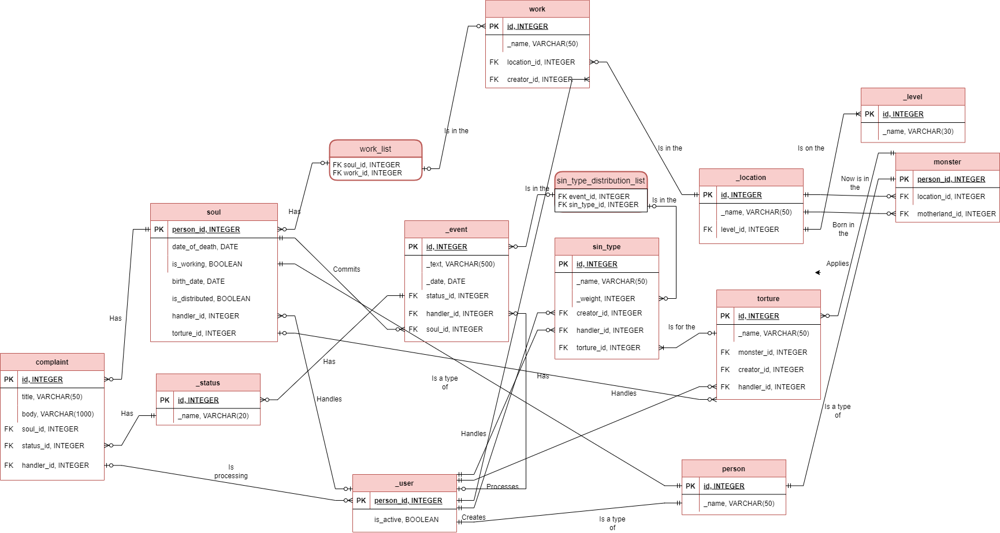

 

  <h3 align="center">WebQuizEngine</h3>

  

    SQL-request generator for particular database of Greek myths lore
     
    
     
     
  

<!-- TABLE OF CONTENTS -->

  
Table of Contents

  <ol>
    <li>
      <a href="#about-the-project">About The Project</a>
    </li>
    <li>
      <a href="#getting-started">Getting Started</a>
      <ul>
        <li><a href="#prerequisites">Prerequisites</a></li>
        <li><a href="#installation">Installation</a></li>
      </ul>
    </li>
    <li>
      <a href="#entities-description">Entities description</a>
      <ul>
        <li><a href="#person">person</a></li>
        <li><a href="#soul">soul</a></li>
        <li><a href="#user">user</a></li>
        <li><a href="#level">level</a></li>
        <li><a href="#location">location</a></li>
        <li><a href="#monster">monster</a></li>
        <li><a href="#torture">torture</a></li>
        <li><a href="#sin_type">sin_type</a></li>
        <li><a href="#status">status</a></li>
        <li><a href="#complaint">complaint</a></li>
        <li><a href="#event">event</a></li>
        <li><a href="#work">work</a></li>
        <li><a href="#sin_type_distribution_list">sin_type_distribution_list</a></li>
        <li><a href="#work_list">work_list</a></li>
      </ul>
    </li>
    <li><a href="#usage">Usage</a>
    </li>
    <li><a href="#contributing">Contributing</a></li>
    <li><a href="#contact">Contact</a></li>
    <li><a href="#links">Links</a></li>
  </ol>

<!-- ABOUT THE PROJECT -->
## About The Project

This project is a system management user interface based on the lore of Hades' Greek hell. 

## Getting started

### Prerequisites

This is an example of how to list things you need to use the software and how to install them.
* [IntelliJ Idea](https://jetbrains.com/ru-ru/idea/download/#section=windows)
* [PostgreSQL](https://www.postgresql.org/download/)

### Installation

1. Open IntelliJ Idea
2. Click on "Get from VCS" button
3. Enter "https://github.com/Mimmey/SqlGenerator.git" in the URL field, choose cloning path and click "Clone"
4. Run project You've just generated dmlScript.sql.
5. Run PostgreSQL
6. Run ddlCreation.sql in PostgreSQL
7. Run dmlScript.sql
8. Enjoy
9. You can run indexEffectivityExplaining.sql if you want to create indices and look at their effectivity.
10. Also you can delete all DB with ddlDeletion.sql

## Entities description

The database is a system by which the Greek god Hades can control the afterlife. The following entities are defined in our database:

### person
Souls, monsters and users are persons.

### soul
Souls enter hell, each of which has a certain list of events that happen to this soul during life. The occurrence of events related to judgment and combination with multiple types of sins. According to the highest standards of the types of sins. If it so happens that the torture is removed, i.e. the entry in the torture id field in the sin_type table is null, or the torture does not have an executing monster, i.e. the monster_id field has a torture value of zero, i.e. the state of torture that will follow after the severity of the disease has occurred in her life. Sin, which suffered in the end by an accident, we will call observable. If the identified sin is not found, then the soul remains undistributed and requires an exclusive decree. This algorithm is represented as a distribution_of_soul_by_algo(soul_identifier)
The date of death of the soul must be greater than the date of birth, and the age of death must not exceed 100 years. 

### _user
Users process complaints, correlate entries from the list of events and types of sins, assign specific tortures to sin types, and also attribute each torture to the executing monster. Users can be authorized, while only one user can be authorized in the system (in this case, it is impossible to authorize as “DELETED”, “UNAUTHORIZED” and “AUTO”). When interacting with the database, the handler_id in the relevant tables is automatically set according to the user who is currently authorized (or the action is marked as “UNAUTHORIZED” (handler_id = 3)). If a user is deleted from the system, they are marked as DELETED (id = 1) in all records. There is also a default handler AUTO (id = 2). Its id = 2 is set to the handler_id field of a soul when torture is attributed to it according to the weight of sin algorithm. Otherwise, there is the id of the handler that attributed the torture to the soul by an exceptional decree. 

### _level
Underworld level. According to the canons of the main levels, there are three: Tartarus, Asphodel Meadow and Elysium

### _location
Sublocation of the level of the underworld.

### monster
After determining the torture, the soul is placed in the location in which the monster performing the assigned torture is located. As soon as the monster is transferred from one location to another, all the souls that are attached to it through torture follow it. The monster can only be found in Tartarus locations.

### torture
For each type of sin, the user assigns torture. The torture has a name, the id of the executing monster, and the id of the user who last assigned the monster to execute this torture.

### sin_type
Each event is associated with a certain type of sin. Each type of sin has the id field of the user who entered this type of sin into the system, the weight of the sin type (from 0 to 1), and the id field of the user who last assigned torture to this type of sin.

### _status
Statuses are the states of complaints and events. When initializing the database, the main status values are ”Not Processed”, “Approved”, “Rejected”

### complaint
Each soul can apply for a transfer to work (instead of torture, the soul can choose to work). The complaint is considered and satisfied / not satisfied. If, based on the results of its consideration, a decision is made to transfer the soul to work, the is_distributed field of this soul is set to false, after which the soul awaits distribution to work. 

### _event
Events - records of key incidents in the life of souls. Each event has a description, the id of the soul that played a key role in the event (if there were several such souls, a separate entry is created for each), the date of the event (required between the dates of birth and death of the soul), as well as the status and id of the user who correlated the event and some types of sins

### work
Each soul can file a complaint about a transfer to work. If the complaint is satisfied, then the soul ceases to be tortured and begins to work. Work can only take place outside Tartarus.

### sin_type_distribution_list
For each event, a certain number of types of sins are determined, which, according to the handler user, took place in this event. All pairs of type "event - type of sin" are entered in the corresponding list. After an event is added to the list, it automatically becomes “processed”, and when all records corresponding to the event are deleted, it goes back to the unprocessed state.

### work_list
If no job has been assigned to the soul yet, but the job transfer request has been approved, the user must manually transfer the soul and add the soul-job pair to the appropriate list. After the pair is added to the list, the soul automatically becomes “allocated” and “working”, and when the entry corresponding to the soul is deleted, it goes back to the unallocated state. 

You can also see a datalogical model of DB:

<!-- USAGE EXAMPLES -->
## Usage

You can control Hades' hell with common SQL selects and inserts. Firstly, you have to register(<i>INSERT INTO person (_name) VALUES ('NON-HANDLED');
INSERT INTO _user (person_id) VALUES (integer person_id);</i>) authorize as a user (using function <i>interface_authorize(integer id)</i>). For all main interactable entities there is an opportunity of saving id of last interacting user in field <i>handler_id</i>.
About another ways of usage you can read in the <a href="#entities-description">Entities description</a>

<!-- CONTRIBUTING -->
## Contributing

1. Fork the Project
2. Create your Feature Branch (`git checkout -b feature/AmazingFeature`)
3. Commit your Changes (`git commit -m 'Add some AmazingFeature'`)
4. Push to the Branch (`git push origin feature/AmazingFeature`)
5. Open a Pull Request

<!-- CONTACT -->
## Contact
Olga Motyleva - motyolya@gmail.com

<!-- LINKS -->
## Links
Project Link: [https://github.com/Mimmey/SqlGenerator](https://github.com/Mimmey/SqlGenerator)

README.md made using: https://github.com/othneildrew/Best-README-Template
